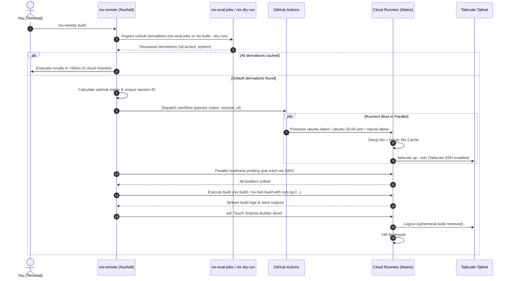

# Nix - Remote Builders Distributed

Nix's remote builders in a distributed manner, including a GitHub Reusable Workflow

## Overview

`nix-remote` allows you to dynamically offload any `nix` command (`build`, `flake check`, `shell`, `develop`) to an on-demand cluster of remote builders.

* **On-Demand & Ephemeral**: Zero 24/7 compute costs. Runners spin up on your chosen provider (GitHub Actions, etc.) only when a build needs compilation and self-destruct when finished.
* **Intelligent Auto-Sizing with `nix-eval-jobs`**: Automatically inspects derivations, skips remote provisioning completely if everything is cached (0s delay), and scales x86/ARM/Darwin runners based on real unbuilt requirements.
* **NAT Traversal via Tailscale**: Direct end-to-end WireGuard tunnel authenticated via OIDC (Workload Identity Federation) or OAuth. No port forwarding or public IP required on your local machine.
* **3-Tier Configurable Lifecycle Watchdog**:
  * `timeout_startup` (default: 300s): Waits for local client to establish first connection.
  * `timeout_idle` (default: 300s): Idle grace window between commands / disconnections.
  * `timeout_linger` (default: 0s): Grace period before shutdown after an explicit completion signal.

## Architecture



## Prerequisites

1. **Tailscale & Tailscale SSH**:
   * Set up Tailscale authentication in your runner repository (`<owner>/<repo>`). You can use any of the following methods:
     * **Method A: Workload Identity Federation / OIDC (Recommended, Secretless)**:
       Create a Trust Credential in [Tailscale Admin → Trust credentials](https://login.tailscale.com/admin/settings/trust-credentials) for GitHub Actions with `tag:nix-builder`. Store `TS_OAUTH_CLIENT_ID` and `TS_AUDIENCE`:
       ```sh
       gh secret set TS_OAUTH_CLIENT_ID --repo <owner>/<repo> --body "<your-client-id>"
       gh secret set TS_AUDIENCE --repo <owner>/<repo> --body "<your-audience>"
       ```
     * **Method B: OAuth Client Credentials**:
       Create an OAuth client in [Tailscale Admin → OAuth clients](https://login.tailscale.com/admin/settings/oauth-clients) with the `auth_keys` write scope and `tag:nix-builder`. Store `TS_OAUTH_CLIENT_ID` and `TS_OAUTH_SECRET`:
       ```sh
       gh secret set TS_OAUTH_CLIENT_ID --repo <owner>/<repo> --body "<your-client-id>"
       gh secret set TS_OAUTH_SECRET --repo <owner>/<repo> --body "<your-client-secret>"
       ```
     *(Note: Secrets can be added as Repository Secrets or scoped within a GitHub Actions Environment e.g. `--env "Nix Builders"`).*
   * Enable Tailscale SSH for `tag:nix-builder` in your [Tailscale ACL Policy](https://login.tailscale.com/admin/acls):
     ```json
     "ssh": [
       {
         "action": "accept",
         "src": ["autogroup:member"],
         "dst": ["tag:nix-builder"],
         "users": ["runner", "root", "autogroup:nonroot"]
       }
     ]
     ```
2. **GitHub CLI (`gh`)**:
   * Installed locally and authenticated (`gh auth login`).
3. **Nix with Flakes enabled**.

## Runner Workflow Setup (Caller Repository)

In your runner repository (where builds will execute in GitHub Actions), copy the caller workflow template to `.github/workflows/nix-builder.yml`:

👉 **[`examples/nix-builder.yml`](examples/nix-builder.yml)**


> [!TIP]
> **Secret Scoping & Environment Fallback**:
> - If `environment: "Nix Builders"` is passed, GitHub Actions resolves secrets from that environment.
> - If `environment` is omitted or set to `""`, the reusable workflow safely evaluates `environment` to `null`. This prevents GitHub Actions from automatically creating empty environments in your repository when using repository-level secrets.
> - Passing timeouts with `format('{0}', inputs.timeout_*)` guarantees type compatibility across reusable workflow boundaries while preserving native numeric input fields in the GitHub Actions dispatch UI.

## Setup

### Flakes

1. Add input to `flake.nix`:
   ```nix
   inputs.nix-remote-builders = {
     url = "github:Malix-Labs/Nix_Remote-Builders-Distributed";
     inputs.nixpkgs.follows = "nixpkgs";
   };
   ```
2. Use as:
   - **Home Manager Module (Recommended)**:
     ```nix
     imports = [
       inputs.nix-remote-builders.homeManagerModules.default
     ];
     ```
   - **Package**:
     ```nix
     inputs.nix-remote-builders.packages.${pkgs.stdenv.hostPlatform.system}.default
     ```
   - **Imperative Profile**:
     - **`nix profile`**:
       ```sh
       nix profile install github:Malix-Labs/Nix_Remote-Builders-Distributed
       ```
     - **`nix-env` (legacy)**:
       ```sh
       nix-env -iE '(import <nixpkgs> {}).callPackage (fetchTarball "https://github.com/Malix-Labs/Nix_Remote-Builders-Distributed/archive/main.tar.gz") {}'
       ```
   - **Ephemeral Shell**:
     - **`nix shell`**:
       ```sh
       nix shell github:Malix-Labs/Nix_Remote-Builders-Distributed
       ```
     - **`nix-shell` (legacy)**:
       ```sh
       nix-shell -p '(import <nixpkgs> {}).callPackage (fetchTarball "https://github.com/Malix-Labs/Nix_Remote-Builders-Distributed/archive/main.tar.gz") {}'
       ```
   - **Ephemeral Run**:
     - **`nix run`**:
       ```sh
       nix run github:Malix-Labs/Nix_Remote-Builders-Distributed -- --repo <owner>/<repo> build .#target
       ```
     - **`nix-shell --run` (legacy)**:
       ```sh
       nix-shell -p '(import <nixpkgs> {}).callPackage (fetchTarball "https://github.com/Malix-Labs/Nix_Remote-Builders-Distributed/archive/main.tar.gz") {}' --run 'nix-remote --repo <owner>/<repo> build .#target'
       ```

### [`tack`](https://github.com/manic-systems/tack)

1. Add dependency:
   ```sh
   tack add nix-remote-builders https://github.com/Malix-Labs/Nix_Remote-Builders-Distributed
   ```
2. Use as:
   - **Home Manager Module (Recommended)**:
     ```nix
     imports = [
       (import (import ./.tack).nix-remote-builders { inherit pkgs; }).homeManagerModules.default
     ];
     ```
   - **Package**:
     ```nix
     import (import ./.tack).nix-remote-builders { inherit pkgs; }
     ```

### [`npins`](https://github.com/andir/npins)

1. Add dependency:
   ```sh
   npins add git https://github.com/Malix-Labs/Nix_Remote-Builders-Distributed -n nix-remote-builders
   ```
2. Use as:
   - **Home Manager Module (Recommended)**:
     ```nix
     imports = [
       (import (import ./npins).nix-remote-builders { inherit pkgs; }).homeManagerModules.default
     ];
     ```
   - **Package**:
     ```nix
     import (import ./npins).nix-remote-builders { inherit pkgs; }
     ```

### [`niv`](https://github.com/nmattia/niv)

1. Add dependency:
   ```sh
   niv add Malix-Labs/Nix_Remote-Builders-Distributed -n nix-remote-builders
   ```
2. Use as:
   - **Home Manager Module (Recommended)**:
     ```nix
     imports = [
       (import (import ./nix/sources.nix).nix-remote-builders { inherit pkgs; }).homeManagerModules.default
     ];
     ```
   - **Package**:
     ```nix
     import (import ./nix/sources.nix).nix-remote-builders { inherit pkgs; }
     ```

### `builtins.fetchGit`

- **Home Manager Module (Recommended)**:
  ```nix
  imports = [
    (import (builtins.fetchGit {
      url = "https://github.com/Malix-Labs/Nix_Remote-Builders-Distributed.git";
      rev = "<COMMIT_HASH>";
    }) { inherit pkgs; }).homeManagerModules.default
  ];
  ```
- **Package**:
  ```nix
  import (builtins.fetchGit {
    url = "https://github.com/Malix-Labs/Nix_Remote-Builders-Distributed.git";
    rev = "<COMMIT_HASH>";
  }) { inherit pkgs; }
  ```

### `builtins.getFlake`

- **Home Manager Module (Recommended)**:
  ```nix
  imports = [
    (builtins.getFlake "github:Malix-Labs/Nix_Remote-Builders-Distributed/<REV_OR_TAG>").homeManagerModules.default
  ];
  ```
- **Package**:
  ```nix
  (builtins.getFlake "github:Malix-Labs/Nix_Remote-Builders-Distributed/<REV_OR_TAG>").packages.${pkgs.stdenv.hostPlatform.system}.default
  ```

### Configuration

#### Home Manager:
Configure your target runner repository and options in your Home Manager configuration:
```nix
programs.nix-remote = {
  enable = true;
  settings = {
    repo = "<owner>/<repo>"; # Target repository hosting your .github/workflows/nix-builder.yml
    environment = "<env-name>"; # Optional: custom GitHub Actions environment containing secrets
    tailscale_tags = "tag:nix-builder"; # Optional: custom Tailscale ACL tags
  };
};
```

#### Standalone / Manual:
Configure `~/.config/nix-remote/config.toml`:
```toml
repo = "<owner>/<repo>"
environment = "<env-name>" # Optional: custom GitHub Actions environment containing secrets
tailscale_tags = "tag:nix-builder" # Optional: custom Tailscale ACL tags
```

## CLI Options (`nix-remote`)

```text
Distribute Nix builds across on-demand cloud runners over Tailscale SSH.

Usage:
  > nix-remote {flags} ...(rest) 

Flags:
  -h, --help: Display the help message for this command
  --provider <string>: Cloud provider backend (default: 'gha')
  --fast: Use nix-fast-build for pipelined eval + remote builds
  --built-in: Force standard nix CLI executor
  --max-runners <int>: Maximum auto-scaled runners (default: 4)
  --runners <int>: Force an exact total number of runners
  --x86 <int>: Force an exact x86_64-linux runner count
  --arm <int>: Force an exact aarch64-linux runner count
  --darwin <int>: Force an exact aarch64-darwin runner count
  --local-jobs <int>: Local Nix jobs limit (0 offloads all builds to remote) (default: 0)
  --timeout-startup <int>: Seconds to wait for initial runner connection (default: 300)
  --timeout-idle <int>: Seconds of inactivity before runner disconnects (default: 300)
  --timeout-linger <int>: Seconds to keep runner alive after build completion (default: 0)
  --repo <string>: Target repository hosting the runner workflow (owner/repo)
  --environment <string>: GitHub Actions environment name containing secrets
  --tailscale-tags <string>: Tailscale ACL tags to apply to runner nodes
  --keep-alive: Keep runners alive after command finishes

Parameters:
  ...rest <string>: Nix command and arguments (e.g. build .#default)
```

## Runner Lifecycle & Watchdog

Each provisioned cloud runner runs a resilient background watchdog script that governs its lifecycle, idle teardown, and self-destruction:

| Lifecycle Phase | Parameter / Signal | Default | Description |
| :--- | :--- | :--- | :--- |
| **Startup Wait** | `timeout_startup` / `--timeout-startup` | `300s` | Runner waits for the local client to establish its first SSH connection. Auto-cancels if client never connects. Set `0` to disable. |
| **Idle Monitor** | `timeout_idle` / `--timeout-idle` | `300s` | Tracks active SSH connections (`ss` / `lsof`) and `nix-daemon` activity. When connections drop to zero and remain idle past this threshold, the runner safely terminates. Set `0` to disable idle teardown. |
| **Completion Signal** | `/tmp/nix-builder-done` | – | `nix-remote` sends `ssh runner@<host> touch /tmp/nix-builder-done` as soon as the build finishes (unless `--keep-alive` is set). |
| **Post-Build Linger**| `timeout_linger` / `--timeout-linger` | `0s` | Once `/tmp/nix-builder-done` is signaled, the runner remains alive for this extra duration before shutting down (useful for running rapid successive builds on a warm runner). |

When terminating, the runner triggers post-run cleanup where `tailscale/github-action` logs out (promptly removing the ephemeral node from your Tailnet) and the GitHub Actions VM terminates.

### Examples

```sh
# Auto-scales runners based on unbuilt derivations detected by nix-eval-jobs
nix-remote build .#myHeavyPackage

# Pass 'nix' prefix optionally (both 'nix-remote build' and 'nix-remote nix build' work)
nix-remote nix build .#myHeavyPackage

# Pass Nix-specific flags (e.g. -L, --print-out-paths) using the '--' separator
nix-remote -- build -L --print-out-paths .#myHeavyPackage

# Run flake checks across remote runners using nix-fast-build
nix-remote flake check

# Explicitly allocate 4 x86_64 and 2 aarch64 runners
nix-remote --x86 4 --arm 2 build .#multiArchTarget

# Keep runners alive for 10 minutes (600s linger) for subsequent builds
nix-remote --timeout-linger 600 -- build -L .#part1

# Override repository without editing config.toml
nix-remote --repo <owner>/<repo> build .#target
```

## Development

Enter the development shell with all dependencies pre-configured and git hooks active:
```sh
nix develop
```

Format code:
```sh
nix fmt
```

Run checks:
```sh
nix flake check
```
