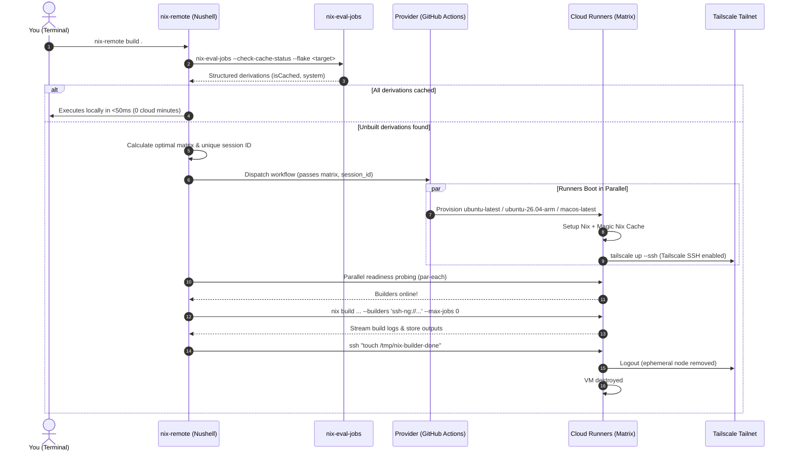

# Nix - Remote Builders Distributed

Nix's remote builders in a distributed manner, including a GitHub Action

## Overview

`nix-remote` allows you to dynamically offload any `nix` command (`build`, `flake check`, `shell`, `develop`) to an on-demand cluster of remote builders.

* **On-Demand & Ephemeral**: Zero 24/7 compute costs. Runners spin up on your chosen provider (GitHub Actions, etc.) only when a build needs compilation and self-destruct when finished.
* **Intelligent Auto-Sizing with `nix-eval-jobs`**: Automatically inspects derivations, skips remote provisioning completely if everything is cached (0s delay), and scales x86/ARM/Darwin runners based on real unbuilt requirements.
* **NAT Traversal via Tailscale**: Direct end-to-end WireGuard tunnel using ephemeral auth keys. No port forwarding or public IP required on your local machine.
* **3-Tier Configurable Lifecycle Watchdog**:
  * `timeout_startup` (default: 300s): Waits for local client to establish first connection.
  * `timeout_idle` (default: 300s): Idle grace window between commands / disconnections.
  * `timeout_linger` (default: 0s): Grace period before shutdown after an explicit completion signal.

## Architecture



## Prerequisites

1. **Tailscale & Tailscale SSH**:
   * Create an **ephemeral, reusable** auth key tagged with `tag:nix-builder` in [Tailscale Admin](https://login.tailscale.com/admin/settings/keys).
   * Save it in your repository or environment secrets as `TAILSCALE_AUTHKEY`:
     ```bash
     gh secret set TAILSCALE_AUTHKEY --env "Nix Builders"
     ```
   * Enable Tailscale SSH for `tag:nix-builder` in your [Tailscale ACL Policy](https://login.tailscale.com/admin/acls):
     ```json
     "ssh": [
       {
         "action": "accept",
         "src": ["autogroup:members"],
         "dst": ["tag:nix-builder"],
         "users": ["runner", "root", "autogroup:nonroot"]
       }
     ]
     ```
2. **GitHub CLI (`gh`)**:
   * Installed and authenticated (`gh auth login`).
3. **Nix with Flakes enabled**.

## Quick Start

### Run directly via Flake:
```bash
# Build a target using on-demand remote builders
nix run github:Malix-Labs/Nix_Remote-Builders-Distributed -- build .#toplevel

# Run a flake check across remote builders
nix run github:Malix-Labs/Nix_Remote-Builders-Distributed -- flake check
```

### Install via Home Manager:
Add to your `flake.nix`:
```nix
inputs.nix-remote-builders.url = "github:Malix-Labs/Nix_Remote-Builders-Distributed";
```

Import the module and configure your default runner repository:
```nix
imports = [
  inputs.nix-remote-builders.homeManagerModules.default
];

programs.nix-remote = {
  enable = true;
  settings = {
    repo = "Malix-Labs/dotfiles";
  };
};
```

### Or install standalone package:
```nix
home.packages = [
  inputs.nix-remote-builders.packages.${pkgs.system}.default
];
```
And manually configure `~/.config/nix-remote/config.toml`:
```toml
repo = "Malix-Labs/dotfiles"
```

## CLI Options (`nix-remote`)

```text
Distribute Nix builds across on-demand cloud runners over Tailscale SSH.

Usage:
  > nix-remote {flags} ...(rest) 

Flags:
  -h, --help: Display the help message for this command
  --provider <string>: Cloud provider backend (default: 'gha')
  --fast: Use nix-fast-build for pipelined parallel eval + remote builds
  --built-in: Force standard nix CLI executor
  --max-runners <int>: Maximum auto-scaled runners (default: 4)
  --runners <int>: Force an exact total number of runners
  --x86 <int>: Force an exact x86_64-linux runner count
  --arm <int>: Force an exact aarch64-linux runner count
  --darwin <int>: Force an exact aarch64-darwin runner count
  --local-jobs <int>: Local Nix jobs limit (default: 0 offloads all builds to remote)
  --timeout-startup <int>: Seconds to wait for initial runner connection
  --timeout-idle <int>: Seconds of inactivity before runner disconnects
  --timeout-linger <int>: Seconds to keep runner alive after build completion
  --repo <string>: Target repository hosting the runner workflow (owner/repo)
  --keep-alive: Keep runners alive after command finishes

Parameters:
  ...rest <string>: Nix command and arguments (e.g. build .#default)
```

### Examples

```bash
# Auto-scales based on unbuilt derivations detected by nix-eval-jobs
nix-remote build .#myHeavyPackage

# Force 8 runners for a massive compile burst
nix-remote --runners 8 build .#chromium

# Custom idle lifecycle: linger for 5 minutes after build for quick follow-up commands
nix-remote --timeout-linger 300 build .#part1
```

## Development

Enter the development shell with all dependencies pre-configured and git hooks active:
```bash
nix develop
```

Format code:
```bash
nix fmt
```

Run checks:
```bash
nix flake check
```
